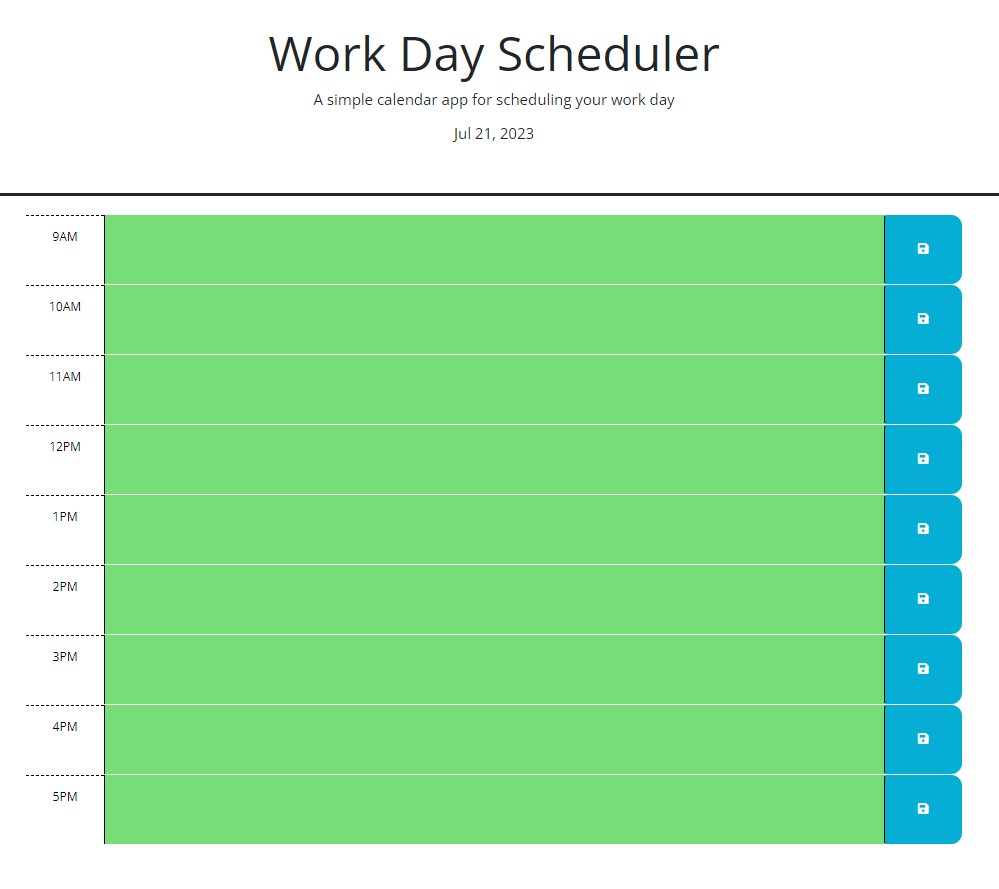

# working-day-calendar

## Description

This is a simple daily scheduler. It was built off a base of HTML, CSS, and JavaScript starter code. It is written in jQuery. Font Awesome and Bootstrap are used for styling too. 

The scheduler has 3 basic features:

- the current date is shown at the top of the scheduler
- each task that is entered into an hour-long time-block section is put into localStorage
- the current time determines the color of each time-block, being red (present), gray (past), or green (future)

Through making the scheduler I:

- gained experience working with Day.js and jQuery
- improved my ability to traverse the DOM using .parent( ) and .prev( )
- worked with localStorage and started to perceive how setItem( ) and getItem( ) are used

---

## Installation

 [See the scheduler online](https://scott-j-clarke.github.io/working-day-calendar/).

---

## Usage

Plan your day with this scheduler and use it to keep you on track from 9AM to 5PM.

---

## Credits

Thank you Trinh for explaining the .each( ) method and this keyword to me!

Thank you Tye for finding the flaw that was prevening localStorage!

Thank you Matteo for providing me with a for loop!

Thank you to Amber, Paige, and the rest of our study group for helping with this assignment!

---

## License

MIT

---

## Screenshot

---